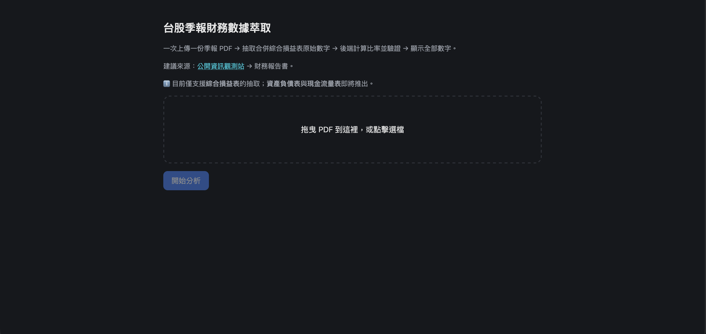
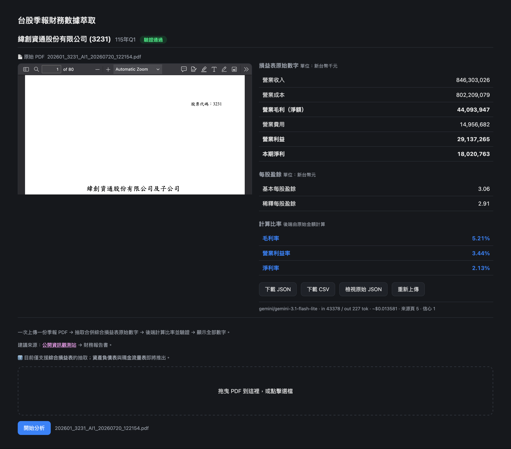

# Portfolio

Frontend case studies from my work on fintech and stock analysis tools.

## Migrating a Legacy React App from CRA to Vite (React 16 → React 19)

Led the migration of a data-heavy financial dashboard from Create React App (React 16.8) to Vite (React 19) — a project touching the build system, routing, and a decade of accumulated dependencies.

One of the trickiest issues was React Router v6/v7's removal of the `withRouter` HOC, which many legacy class components relied on to access `history`, `location`, and `match` as props. I built a custom polyfill to preserve the old API surface, but an early version caused an infinite re-render loop — the app would crash with "Too many calls to Location or History APIs." The root cause was that the polyfilled `history` object was a new reference on every render, and several components used it as a `useEffect` dependency. Wrapping it in `useMemo` resolved the instability.

Another core challenge was Vite's reliance on native ES Modules, which broke CommonJS-style `require()` calls used throughout the Highcharts integration. These needed to be rewritten module-by-module into ES6 imports.

Perhaps the most important decision, though, was knowing when *not* to upgrade. Both D3 and Highcharts had newer major versions available, but bumping them introduced breaking changes — D3 v7's removal of the global `d3.event` broke several custom chart components, and major Highcharts version jumps risked visual regressions across dozens of chart types already in production. Rather than chasing the latest versions, I evaluated the actual risk-to-benefit ratio and kept these libraries pinned, prioritizing stability for a production financial tool over technical novelty.

## Financial Statement Extraction from PDF Reports Using LLM Structured Output

**[Repo](https://github.com/eat46/fs-extractor)**

This project mirrors a similar tool I built at work — one that extracts structured financial data from research documents into a human-review UI — which couldn't be open-sourced due to confidentiality. This is a parallel implementation using public company financial statements instead.

Built a tool that extracts key financial metrics from Taiwan-listed companies' quarterly reports — converting scanned PDF income statements into structured JSON/CSV, with Claude's structured output enforcing a strict schema so extraction results are consistent and machine-readable.

A key design decision was separating what the LLM extracts from what gets calculated. Rather than asking the model to compute ratios like gross margin or operating margin — which risks silent rounding errors or fabricated numbers — the LLM only extracts raw figures printed on the statement (revenue, cost, gross profit, operating income, net income, EPS). All derived ratios and cross-checks are computed deterministically in a separate validation layer.

That validation layer surfaces a subtlety specific to Taiwan's consolidated financial statements: companies with intra-group transactions report a pre-adjustment gross profit line and a separate net gross profit line after eliminating unrealized intercompany gains. Reconstructing gross profit as simply revenue minus cost only holds exactly against the pre-adjustment figure — treating it as a hard equality against the reported (post-adjustment) number produces false-positive warnings for companies with subsidiary structures. The validation layer distinguishes "arithmetic must hold exactly" from "a real accounting adjustment exists here," rather than collapsing both into one fuzzy tolerance threshold.

The LLM provider itself is abstracted behind a common interface, so switching between Claude and Gemini is a single environment variable change rather than a rewrite.

## Performance Optimization for Multi-Chart Comparison Dashboard

Built a peer comparison dashboard displaying 10+ charts simultaneously — covering revenue forecasts, profitability trends, valuation multiples, and capital expenditure — each comparing a selected stock against multiple industry peers across different time ranges.

Rendering this many data-heavy charts at once created a real performance bottleneck. To solve this, I implemented lazy rendering using the Intersection Observer API: charts only fetch data and initialize once they scroll into the viewport, significantly reducing initial load time and unnecessary computation for charts the user might never scroll to.

For several charts, I also built a toggle between an absolute comparison view (each peer plotted individually) and a relative view that aggregates all other peers into a single "industry total" series, contrasted against the selected stock. This aggregation logic — summing and reshaping peer data into a two-series comparison — is computed entirely on the frontend, allowing users to instantly reframe the analysis from "how do we compare to each peer" to "how do we compare to the market as a whole."

## Multi-Dimensional Stock Screening Radar Chart

Built a radar chart using D3.js to help users evaluate a stock's strength across multiple proprietary indicators — such as foreign/investment trust buying momentum, institutional flow trends, and revenue growth — at a glance.

D3 was chosen over Highcharts for this feature because it offered more flexibility in both shape rendering and interaction handling, which was necessary given the custom scoring logic involved. One of the trickier implementation details was label alignment: since indicator names vary significantly in length, positioning them cleanly around the circular axis without overlap or visual imbalance required careful adjustment.

The chart works alongside a separate hard-filter system — users first narrow down stocks using binary screening criteria (e.g., volume thresholds, technical signals), then the radar chart visualizes how the filtered stock performs across ten weighted dimensions, with raw business metrics converted into normalized 0-100 scores by the backend.

## Structure-Preserving Financial Heatmap with Interactive Analysis

Built a financial statement visualization that lets investors scan a company's income statement, balance sheet, cash flow, and financial ratios — and instantly spot which line items are improving or deteriorating, turning 20–40 dense accounting figures per statement into a pre-attentive visual scan.

The left panel is a hand-built heatmap tile grid (CSS Grid + dnd-kit). Each tile is an accounting item, positioned to mirror real financial-statement layouts — assets on the left, liabilities and equity on the right; a revenue-to-net-income waterfall top to bottom — with six templates tailored to each sector's statement structure (financial holding, brokerage, insurance and etc).

This layout was a deliberate choice over three alternatives: a true treemap (area-encoding breaks on negative accounting values, and algorithmic layout destroys the familiar statement structure), bar charts or tables (too slow for at-a-glance screening across dozens of items), and off-the-shelf chart libraries (their nodes can't serve as drag sources — DOM tiles can). Each tile doubles as an interactive control: click to see its trend in the right-panel Highcharts time-series, or drag it onto the chart for on-the-fly cross-statement comparison.

Color encodes the delta between the earliest and latest points in the selected range — red for growth, green for decline (Taiwan market convention) — with opacity scaling to magnitude, so users spot outliers without reading a single number.

## Other Projects

- **[Calculators](https://github.com/eat46/calculators)** — A set of investing calculators for Taiwan stock investors (dividend yield entry price, CAGR, ex-dividend reference price, scenario-weighted fair value). [Live Demo](https://eat46-calculators.vercel.app/)
